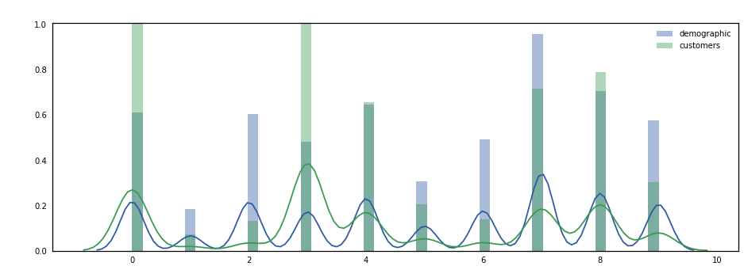
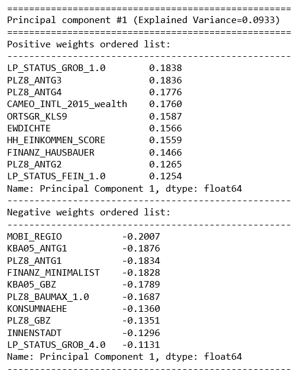

# Unsupervised Learning Project
This is an unsupervised learning Data Science project for Udacity Nanodegree program to identify segments of the population that form the core customer base for Bertelsmann Arvato, a mail-order sales company from Germany. 

## Summary
The project's objective is to apply the unsupervised learning techniques over the demographic dataset in order to obtain the segments of population and then to compare these segments with the prevalent customers from the customer dataset.   

The project has the following steps:

 - **Load the data**:
    - *Udacity_AZDIAS_Subset.csv*: Demographics data for the general population of Germany; 891211 persons (rows) x 85 features (columns).
    - *Udacity_CUSTOMERS_Subset.csv*: Demographics data for customers of a mail-order company; 191652 persons (rows) x 85 features (columns).
    - *Data_Dictionary.md*: Detailed information file about the features in the provided datasets.
    - *AZDIAS_Feature_Summary.csv*: Summary of feature attributes for demographics data; 85 features (rows) x 4 columns 
    
    Note: None of these data are included in the repository.

 - **Preprocessing**:
     + Handle missing values (per column, per row)
     + Re-Encode Categorical Features
     + Engineer Mixed-Type Features
     + Complete Feature Selection
     + Create a Cleaning Function

 -  **Feature Transformation**:
     +  Apply Feature Scaling
     +  Perform Dimensionality Reduction (using PCA)
     +  Interpret Principal Components

 - **Clustering**:
     + Apply Clustering to General Population
     + Apply All Steps to the Customer Data
     + Compare Customer Data to Demographics Data

## Result

<div align="center">
  <h4>Demographic vs. Customers Distribution</h4>
  
</div>

<div align="center">
  <h4>Principal Components</h4>
  
</div>

The interpretation of the comparison was a bit difficult due to the lacking of clear feature contrast between the customers and non-customers that I couldn't find.

It seems that the customers are mostly of higher age, they live in a multiperson household in a region with average to high purchasing power. They are prudent in financial decisions and they have strong affinity to environmental issues. On the other side, the non-customers have lower income, they live in small cities in buildings with many apartments and they have low financial interest. 

## Installation
### Clone
```sh
$ git clone https://github.com/amosvoron/learn-datascience-unsupervised-learning.git
```

## Repository Description

```sh
- Identify_Customer_Segments.ipynb      # project notebook
- result-comparison.png                 # image: comparison between the both datasets
- result-principal-components.png       # image: principal components
- README.md                             # README file
- LICENCE.md                            # LICENCE file
```

## License

MIT
