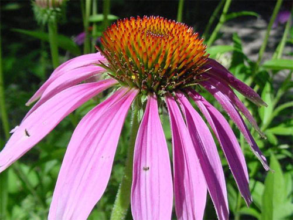

# Image Classifier Project
This is a Data Science project for Udacity Nanodegree program which trains an image classifier to recognize different but limited (among 102) species of flowers using a pretrained model. 

## Summary

The project contains the following steps:

 - Load and preprocess the image dataset
 - Train the image classifier on the dataset
 - Use the trained classifier to predict image content

### Load 

The dataset was loaded by **torchvision** and then split into three parts: *training*, *validation*, and *testing*. For the training, I applied the transformations such as random scaling, cropping, and flipping. 

The validation and testing sets are used to measure the model's performance on data it hasn't seen yet. For this we don't need to do scaling or rotation transformations, we only need to resize and crop the images to the appropriate size.

For all three sets we need to normalize the means and standard deviations of the images to what the network expects. 

### Train

In order to build and train the classifier I needed to:

 - Load a pre-trained network. 
 - Define a new, untrained feed-forward network as a classifier, using ReLU activations and dropout.
 - Train the classifier layers using backpropagation.
 - Track the loss and accuracy on the validation set to determine the best hyperparameters.

### Predict

A common practice is to predict top 5 or so (usually called top-*K*) most probable classes which means that we have to find the *K* largest values. To get the top *K* values I used a tensor x.topk(k) method that returns both the highest *k* probabilities and the indices of those probabilities corresponding to the classes. Finally, I converted these indices to the actual class labels.

<div align="center">
  <h4>Purple coneflower (Echinacea purpurea)</h4>
  
</div>

## Installation
### Clone
```sh
$ git clone https://github.com/amosvoron/udacity-image-classifier.git
```

## Repository Description

```sh
- ImageClassifier.ipynb             # classifier (jupyter notebook file)
- cat_to_name.json                  # categories JSON file
- predict.py                        # predicting command-line application
- train.py                          # training command-line application
- utils.py                          # python libraries
- README.md                         # README file
- LICENCE.md                        # LICENCE file
```

## License

MIT
