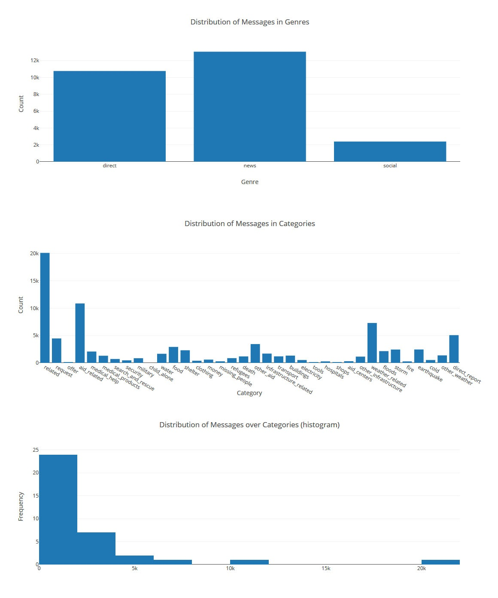
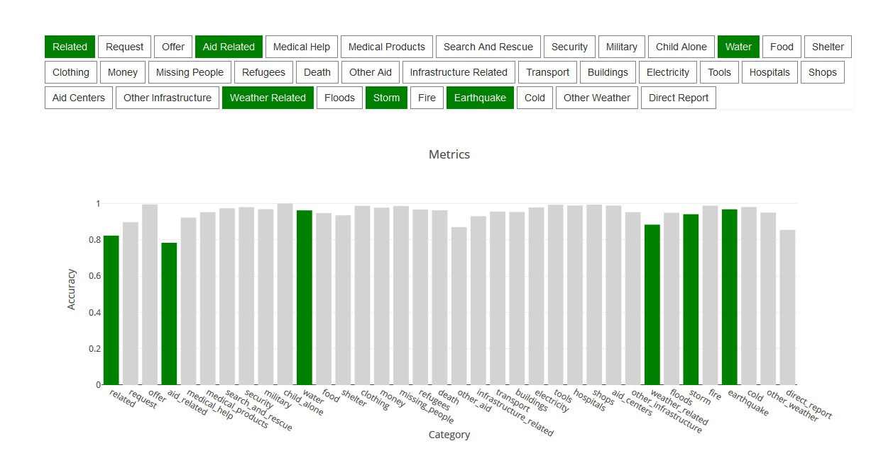

# Disaster Response Pipelines Project
This is a Data Science project for Udacity Nanodegree program that combines *Software Engineering* and *Data Engineering* tasks with an objective to create a model trained to classify disaster response messages accessible to the end user through the web application.

## Summary

While the Software Engineering part includes writing a clean, modular, well-documented python code that performs Data Engineering tasks, the Data Engineering part consists of preparing **3 types of pipelines** whose input data are pre-labeled text messages from real life disasters:

   - **ETL (Extract-Transform-Load) pipeline**
   - **NLP (Natural Language Processing) pipeline**
   - **ML (Machine Learning) pipeline**

We use ETL pipeline to prepare input data. Then we apply NLP techniques to normalize, tokenize, and lemmatize words extracted from the text messages. In the last step we use ML pipeline (including TF-IDF pipeline) to build a supervised learning model. 

Lastly, we create a simple Flask website that reads the stored model and classifies the messages passed by the end user. Apart from the classification task the application also shows some general visualization graphs of the training dataset and the classifier graph based on the classification result.

### General Graphs

<div align="center">
  
</div>

### Classification Metrics Graph

<div align="center">
  
</div>

## Installation
### Clone
```sh
$ git clone https://github.com/amosvoron/udacity-disaster-response-pipelines.git
```

### Instructions:
1. Run the following commands in the project's root directory:

To run ETL pipeline that **cleans data and stores in database**:
    
```sh
$ python data/process_data.py data/disaster_messages.csv data/disaster_categories.csv data/DisasterResponse.db
```
To run ML pipeline that **trains classifier and saves**:
    
```sh
$ python models/train_classifier.py data/DisasterResponse.db models/classifier.pkl
```

<p align="center" style="margin-top:-10px; color:red; font-size:0.9em">Attention! It may take a while to complete the command execution.</p>

2. Run the following command in the app's directory to **run your web app**:

```sh
$ python run.py
```
3. Open another Terminal Window and type:

```sh
$ env|grep WORK
```
which will give you SPACEID and SPACEDOMAIN values.

4. Then go to 

https://viewSPACEID-3001.SPACEDOMAIN 

replacing SPACEID and SPACEDOMAIN with the corresponding values. 

## Repository Description

```sh
- app
| - templates
| |- master.html                    # main template of web app
| |- go.html                        # classification result page of web app
|- run.py                           # Flask file that runs app

- data
|- disaster_categories.csv          # input categories data 
|- disaster_messages.csv            # input messages data
|- process_data.py                  # ETL pipeline code
|- DisasterResponse.db              # database to save clean data to

- models
|- train_classifier.py              # ML pipeline code

- notebook
|- ETL Pipeline Preparation.ipynb   # ETL pipeline code (jupyter notebook file)
|- ML Pipeline Preparation.ipynb    # ML pipeline code (jupyter notebook file) 

- Graphs1-3.jpg                     # general graphs
- Graph-4.jpg                       # classsifier graph
- README.md                         # README file
- LICENCE.md                        # LICENCE file
```

## License

MIT
