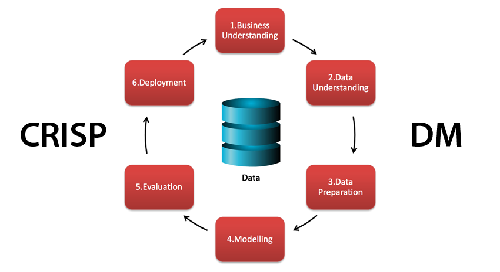

# Udacity StackOverflow Project
This is a Data Science project for Udacity Nanodegree program based on the 2019 Stack Overflow's survey results. 
## Installation
### Clone
```sh
$ git clone https://github.com/amosvoron/udacity-crispdm.git
```
## Project Motivation
This project is the first project in the Udacity Data Science Nanodegree program course. Being a software developer for more than 10 years I've chosen the StackOverflow data to analyse which appeared a logical choice to me.

## Methodology 

<div align="center">
  
</div>

The project methodology is CRISP-DM which stands for *cross-industry standard process for data mining*. Let me explain how the CRISP-DM steps were applied throughout the project:

### 1. Business Understanding
"Stack Overflow is the largest, most trusted online community for developers to learn, share​ ​their programming ​knowledge, and build their careers." (https://stackoverflow.com). 

I'm using 2019 survey result data to get some insights, quite different in their topics. I want to apply inferential statistics to reach conclusions about most popular technologies among developers. Then I want to explore if the formal education level has any influence over the developers decisions which non-formal education programs they choose. And, finally, I want to apply the machine learning using linear regression model to predict the salary by a limited number of features.      

##### Related business questions

1. *What are the most popular programming languages, databases, platforms, web frameworks, and other frameworks among the developers?*

2. *Is there any strong correlation between the education level and non-degree education? Is there a notable difference between the low education and high education in relation to the non-formal education?*

3. *Can we predict the salary reaching around 0.7 of R-squared by using a limited number of features? (Our benchmark here is the result in the Udacity lesson of the project course with the similar StackOverflow data where the best fitting regression model for salary prediction reached 0.7 of R-squared with around 1000 features.)* 

##### Business success criteria

*First question*: get the list of most popular technologies.

*Second question*: get the yes/no answer.

*Third question*: predict "well" the salary with minimum features. 

##### Data mining success criteria

*First question*: the inferential statistics applied over a chosen set of tech features, the result should be the list of technologies ordered by the frequency/percentage of total use.

*Second question*: the correlation matrix of formal education level features and non-formal education features confirming or disapproving the correlation.

*Third question*: the regression model fitted to predict the salary with 0.7 R2 and substantially less than 1000 features.

### 2. Data Understanding

The StackOverflow data set from the Developer Survey 2019 has 88883 rows and 85 columns. The columns represent the answers on survey questions grouped into the following sections:

- **Basic Info** (7 columns)
- **Education, Work, Career** (36 columns)
- **Tect and tech Culture** (21 columns)
- **Stack Overflow** (13 columns)
- **Demographics** (8 columns)

In total, 6 columns contain *numeric data*, other columns contain *categorical data*. 

##### Sections/columns of interest

*First question*:

- **Tect and tech Culture** section with the following columns:

    + LanguageWorkedWith (*programming languages*)
    + DatabaseWorkedWith (*databases*)
    + PlatformWorkedWith (*platforms*)
    + WebFrameWorkedWith (*web frameworks*)
    + MiscTechWorkedWith (*other technologies*)

*Second question*:

- **Education, Work, Career** section with the following columns:

    + EdLevel (*formal education*)
    + EduOther (*non-formal education programs*)

*Third question*:

- **Basic Info** (all columns with scalar values)
- **Education, Work, Career** (all columns with scalar values)
- **Demographics** (all columns with scalar values)

In the third topic we'll simplify our work by excluding columns with non-scalar values (few columns with concatenated values). 

##### Exploring data

*First question*: 

- All target columns contain concatenated values of categorical features. The respondents could choose different technologies.
- The missing values do not exceed 35%. We'll remove missing values since in the inferential statistics we'll only focus on the existing data.

*Second question*: 

- **EdLevel** column is a categorical feature containing scalar values. **EduOther** column is a categorical feature containing concatenated values. 
- The missing values do not exceed 7.5%. The percentage is low, we'll remove them.

*Third question*: 

- The label to predict is **ConvertedComp** column that represents the annual salary converted in USD. It's ready-made data, we'll not need to process salary data given in local currencies or/and in different time period (*CurrencySymbol*, *CompFreq*, *CompTotal*).
- The max salary is 2 mio USD, the mean is 127,000 USD and the standard deviation is 284,000 USD.
- The salary histogram reveals that the salary distribution is extremely right skewed. We get more moderate right skewed distribution when we limit the upper boundary of the salary to 200.000 USD. This tells us that there must be some outliers that affects the distribution. 
- The boxplot visualization confirms that assumption. The threshold is 170.000 USD. We'll remove all data that exceeds it.  
- The salary missing values reach 37%. Quite high, but being a label we opt for removing the missing label values. 

### 3. Data Preparation

*First question*: 

- We remove rows with missing values, parse concatenated values of the target columns and merge all values into a single list, one per column.
- Then we performs very basic statistic calculation: distribution of values in the sample, calculating the frequency and the percentage. Having done this, we plot the results and we are done with the first topic.

 

*Second question*: 

- We remove rows with missing values.
- The column **EdLevel** holds the information about the formal education (9 categories). The second topic requires the information about the *education level* which is not found in the data set, so it must be derived from the *education*. We'll create a new (binary) feature called **EduHigh** which will contain the information about the education level: '1-High' or '0-Low'. 
- We define the following criteria to designate a certain education as high or low: if the education's degree is "*Master’s degree*", "*Other doctoral degree*", or "*Professional degree*", then the education is considered as "high"; otherwise it is considered as "low".  
- We parse the concatenated values of the second column **EduOther** and one-hot encode the categories. 
- In the next step, we build the correlation matrix including the *EduHigh* derived feature and all categories of the feature *EduOther* and check the coefficients. We immediately notice very weak correlation between the formal education level and non-formal education.
- In the last step we perform a simple statistic calculation: for each *EduHigh* category we calculate the frequency of participation in each of the  non-formal education degree category. The result confirms what the correlation matrix was revealing - the education level has no impact on the developer's choice of non-formal education degree programs. And we are done with the second topic.

<div align="center">
  
  <p style="font-size: 0.9em; color: grey">Distribution of non-degree programs grouped by the formal education level</p>
  <br />
</div>

*Third question*: 

##### Data selection

- For the third topic we decided to focus on the *basic info*, *demography*, and *education and career features* which means that the columns will be selected from these three sections only. We obtain a raw list of all possible columns from the sections of interest.  
- We exclude all columns from which the column *ConvertedComp* (label) has been derived.  
- We also exclude few columns with the concatenated values, so the list of variable candidates gets shorter a little bit.
- In the next step we calculate the correlation coefficients for each category of the column feature relating to the salary feature. For each column we select the coefficient with the max value and create a list of all max coefficients, one per column. Once the list of max coefficients is obtained, we cut off all columns whose max coefficient is below 0.7.

<div align="center">
  
  <p style="font-size: 0.9em; color: grey">Selected columns using max correlation coefficient</p>
  <br />
</div>

##### Data cleaning

###### Label: Salary

- We remove the missing labels.
- We remove the outliers (salary above 170.000 USD).

###### Variables

- The total percentage of rows with at least one missing value is 16.37% distributed mostly over the column *UnitTests* with 8.79% and the column *Age* with 3.98% of missing values. I checked the option to create a separate category for missing values but it didn't produce any relevant outcome. I discarded the option to impute missing values (mean imputation) in order to avoid introducing bias. I also didn't opt for the option to use algorithms such as KNN, MICE, MissForest, or GANs due to a simple fact that the implementation of those algorithms exceeded my learning level and I didn't want to spend too much time with something that I was not sure that it would bring me some relevant results. 
- Therefore, we remove the rows with the missing values.  

Country

- Since we’d like to predict with the *minimum number of variables* we find 159 countries too many. So we decide to limit the number of countries to 50. We will keep *top 50 countries* with **the highest frequency**.   

 

- Without any doubt, the salary depends on the country. You'll very likely not earn the same money as developer in Nigeria or in the United States.

Student

- We need to apply the data transformation over two categories: "Yes, full-time", "Yes, part-time". We only need the information if the developer is a student or not, so we convert the both categories into "Yes".

YearsCode, YearsCodePro

- We must improve the quality od the data in the columns **YearsCode** and **YearsCodePro** since not all values are numeric. There are two string values that we convert into a numeric value.

### 4. Modeling

*Third question*:

We want to predict a certain value (*salary*). In our first Data Science project we decided to use a **linear regression algorithm** which is the most rudimental Machine Learning algorithm.

1. First we create dummy variables for all categorical columns.
2. Then we split our data into explanatory matrix X (predictors) and response vector y (labels). 
3. We apply X matrix reduction by cutting off the predictors. The size of the reduction is determined by the cutoff parameter.
4. We further split our data into train and test data.
5. Using scikit learn to import the linear regression model we create the model with data normalization.
6. We fit the model and obtain prediction response for train and test data.    
7. We use R2 score to measure the accuracy of our model.
8. We repeat the steps 3-7 using different values for the cutoff parameter, until all given cutoff values are used. 

<div align="center" style="margin: 0 auto; width: 75%">
  
  <p style="font-size: 0.9em; color: grey">R2 values with number of features (50 countries)</p>
  <br />
</div>

##### Model assessment

We have evaluated our model using R2 score which gives us the percentage of  variance explained by model related to the total variance of data. The graph shows that we achieve around 54% of R2 with 30 predictors and around 70% with 100 predictors. 

We can also see that the curves for training and testing data are all the time in a parallel position, no point of separation appears which means that there is still some margin for adding more predictors. This is in accordance with the benchmark result (Udacity Data Science lesson 1 on CRISP-DM) where the maximum R2 was reached with around 1000 predictors until the lines started to separate and adding more predictors worsen the test result.

If we take a quick look at the top predictors with the heighest coefficients, then we can rank their features as follows:

- **Country** (*Unites States*, *Switzerland*, *Israel*, *Denmark*, *Norway*, ...)  
- **Employment** (*part-time*)
- **Education level** (*Other doctoral degree*, *Master's degree*, *no formal education*)
- **Organization size** (*small companies*: 2-19 employees)
- **Unit tests** (*Yes, it's part of our process*)
- **Code review** (*Yes, because I see value in code review*) 

The *Country* is the feature with the most impact on salary which can be easily understood due to the huge GDP differences between countries. *Part-time employment* has a negative impact on salary, one cannot gain the same salary if he or she works part-time or full-time. *High education level* increases the salary, also easy to understand. The *small companies* do not compensate the developers' work equally high as bigger companies do. Finally, performing *unit tests* and *reviewing code* is apparently also an influential factor that has a positive impact on salary.  

### 5. Evaluation

*First question*:

The business goal to get a list of most popular technologies was fullfilled and the result is easy to interpret: The **web programming** (JavaScript, HTML/CSS) is prevalent. The open-source databases **MySQL** and **PostgreSQL** are the most frequently used databases. **Linux** and **Windows** are the most popular platforms. The javascript libraries — **jQuery**, **React** and **Angular** — dominate the web programming. Microsoft technologies **ASP.NET**, **.NET (Core)** and **SQL Server** are still among the top used technologies.

*Second question*:

We obtained clear Yes/No answer - **NO** - which satisfies the goal of the second topic. The education level has *no impact* on developer's decision in which non-formal education program to participate.  

*Third question*:

The goal of the third topic is also achieved: we reached 0.7 R2 with only 100 variables improving the benchmark result.

Overall, we can be satisfied, *the project has met the initial business objectives*.

### 6. Deployment

The code of this project can be found on my [GitHub](https://github.com/amosvoron/Udacity_StackOverflow). You can also check my [blog](https://medium.com/@amos.voron/stackoverflow-some-insigths-about-survey-2019-74dd85313e26).


## Repository Description

```sh
- data
| - schema.csv                      # data set's schema with Section column
| - so_survey_2019.pdf              # main template of web app
| - survey_result_public.zip        # data set (zipped containing the CSV file)
| - survey_result_schema.csv        # data set's schema (in CSV format)

- Stackoverflow.ipynb               # Jupyter Notebook file with python code
- crispdm.png                       # CRISP-DM image for README.md
- README.md                         # README file
- LICENCE.md                        # LICENCE file
```

## License

MIT

